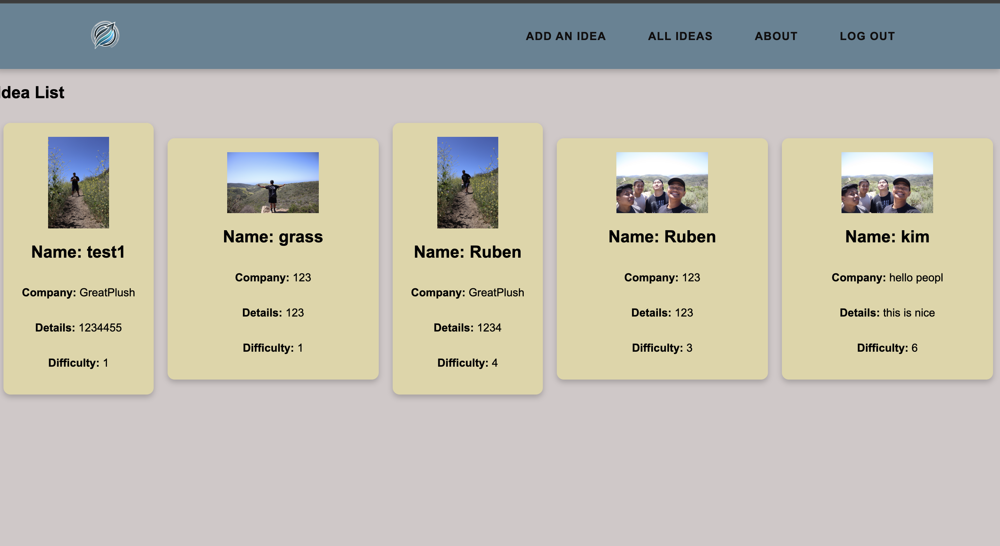

# NextStep Innovations

## what is it? 
NextStep is for whenever you get those thoughts of creativity about how to improve something. This has the potential to capitalize on your ideas. First you would come up with the name of the idea then get the company to potentially work with them. The details of it and if you have a sketch or image of the idea an option to put it up as well as the difficulty scale 1 being easy to 10 being hardest to implement.

## All the links
[Deployed project link](https://nextstep-d44aeb47a178.herokuapp.com/)

[GitHub repo link](https://github.com/kolaster123/NextStep/tree/main)

[TrelloBoard](https://trello.com/b/9OLoo1nTnextstep-innovations-taking-whats-good-and-making-it-even-better)

## Attributions

[geeksforgeeks](https://www.geeksforgeeks.org/imagefield-django-models/)

[background remover](https://www.remove.bg/)

[enum help](https://stackoverflow.com/questions/54802616/how-can-one-use-enums-as-a-choice-field-in-a-django-model)

[chatgpt.com](https://chatgpt.com/)

[color pallete](https://coolors.co/628395-96897b-dfd5a5-dbad6a-cf995f)

## Technologies used

* Github
* Visual Studio Code
* Python
* CSS 
* Django
* HTML

## Next Steps
* I would like to add a reminder that the user can set to remind them "hey looks like you forgot to check this off" and give a checklist option if they need.
